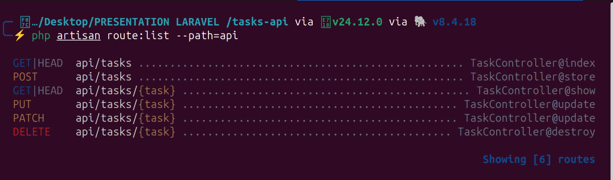

# 🚀 Tasks API — Laravel REST API

> Projet de démonstration : Comprendre et Créer une API REST avec Laravel  
> Stack : Laravel  · Eloquent · API Resources · Mysql · Postman

---

## 📋 Table des Matières

1. [Prérequis](#-prérequis)
2. [Installation du Projet](#-installation-du-projet)
3. [Structure du Projet](#-structure-du-projet)
4. [Étape 1 — Initialiser l'API](#étape-1--initialiser-lapi)
5. [Étape 2 — La Migration (Base de données)](#étape-2--la-migration-base-de-données)
6. [Étape 3 — Le Modèle Task](#étape-3--le-modèle-task)
7. [Étape 4 — L'API Resource (Transformation JSON)](#étape-4--lapi-resource-transformation-json)
8. [Étape 5 — La Form Request (Validation)](#étape-5--la-form-request-validation)
9. [Étape 6 — Le Contrôleur](#étape-6--le-contrôleur)
10. [Étape 7 — Les Routes](#étape-7--les-routes)
11. [Étape 8 — Lancer le serveur](#étape-8--lancer-le-serveur)
12. [Étape 9 — Tester avec Postman](#étape-9--tester-avec-postman)
13. [Récapitulatif des Endpoints](#-récapitulatif-des-endpoints)
14. [Codes de Statut HTTP](#-codes-de-statut-http)

---

## 🔧 Prérequis

Avant de commencer, assurez-vous d'avoir installé :

| Outil | Version minimale | Vérification |
|-------|-----------------|--------------|
| PHP | 8.2+ | `php -v` |
| Composer | 2.x | `composer -v` |
| Laravel | 11.x | `laravel -V` |
| Postman | Dernière version | — |

---

## 📦 Installation du Projet

```bash
# 1. Créer un nouveau projet Laravel
composer create-project laravel/laravel tasks-api

# 2. Aller dans le dossier
cd tasks-api

# 3. Configurer la base de données (SQLite — simple pour la démo)
```

Dans le fichier `.env`, modifier la configuration de la base de données :

```env
DB_CONNECTION=mysql
DB_HOST=127.0.0.1
DB_PORT=3306
DB_DATABASE=taskApi
DB_USERNAME=xxxxxx
DB_PASSWORD=xxxxxx
```

---

## 🗂 Structure du Projet

Voici les fichiers que nous allons créer / modifier :

```
tasks-api/
├── app/
│   ├── Http/
│   │   ├── Controllers/
│   │   │   └── TaskController.php       ← Logique métier
│   │   ├── Requests/
│   │   │   └── StoreTaskRequest.php     ← Validation des données
│   │   └── Resources/
│   │       └── TaskResource.php         ← Transformation JSON
│   └── Models/
│       └── Task.php                     ← Modèle Eloquent
├── database/
│   └── migrations/
│       └── xxxx_create_tasks_table.php  ← Structure BDD
├── routes/
│   └── api.php                          ← Nos endpoints REST
└── .env                                 ← Configuration
```

---

## Étape 1 — Initialiser l'API

Depuis **Laravel 11**, les fonctionnalités API ne sont **pas activées par défaut**.  
Cette commande fait 3 choses en une :

```bash
php artisan install:api
```

✅ Crée le fichier `routes/api.php`  
✅ Applique le préfixe `/api` automatiquement à toutes les routes  
✅ Installe Laravel Sanctum (pour l'authentification future)

---

## Étape 2 — La Migration (Base de données)

La migration définit la **structure de la table** dans la base de données.

```bash
# Générer la migration
php artisan make:migration create_tasks_table
```

Modifier le fichier généré dans `database/migrations/` :

```php
<?php
// database/migrations/xxxx_create_tasks_table.php

use Illuminate\Database\Migrations\Migration;
use Illuminate\Database\Schema\Blueprint;
use Illuminate\Support\Facades\Schema;

return new class extends Migration
{
    public function up(): void
    {
        Schema::create('tasks', function (Blueprint $table) {
            $table->id();                          // Clé primaire auto-incrémentée
            $table->string('title');               // Titre de la tâche (obligatoire)
            $table->text('description')->nullable(); // Description (optionnelle)
            $table->boolean('completed')->default(false); // Statut (false par défaut)
            $table->timestamps();                  // created_at & updated_at
        });
    }

    public function down(): void
    {
        Schema::dropIfExists('tasks');
    }
};
```

```bash
# Exécuter la migration (crée la table en BDD)
php artisan migrate
```

---

## Étape 3 — Le Modèle Task

Le modèle est la **représentation PHP** de notre table. Il utilise **Eloquent ORM**.

```bash
# Générer le modèle
php artisan make:model Task
```

```php
<?php
// app/Models/Task.php

namespace App\Models;

use Illuminate\Database\Eloquent\Model;

class Task extends Model
{
    // Les champs que l'on autorise à remplir en masse (sécurité)
    protected $fillable = [
        'title',
        'description',
        'completed',
    ];

    // Conversion automatique des types
    protected $casts = [
        'completed' => 'boolean',
    ];
}
```

> **Pourquoi `$fillable` ?**  
> C'est une protection contre les attaques **Mass Assignment**. On déclare explicitement quels champs peuvent être remplis automatiquement depuis une requête HTTP.

---

## Étape 4 — L'API Resource (Transformation JSON)

**Règle d'or : Ne jamais retourner la base de données brute au client !**

L'API Resource sert de **couche de transformation** entre le modèle et le JSON envoyé.

```bash
# Générer la Resource
php artisan make:resource TaskResource
```

```php
<?php
// app/Http/Resources/TaskResource.php

namespace App\Http\Resources;

use Illuminate\Http\Request;
use Illuminate\Http\Resources\Json\JsonResource;

class TaskResource extends JsonResource
{
    public function toArray(Request $request): array
    {
        return [
            'id'          => $this->id,
            'title'       => $this->title,
            'description' => $this->description,
            'completed'   => $this->completed,
            'created_at'  => $this->created_at->format('d/m/Y H:i'),
        ];
        // Note : on n'expose PAS updated_at, ni les flags internes de la BDD
    }
}
```

**Avant (sans Resource) :**
```json
{
  "id": 1,
  "title": "Faire les courses",
  "completed": 0,
  "created_at": "2023-10-24T14:32:00.000000Z",
  "updated_at": "2023-10-24T14:32:00.000000Z",
  "internal_db_flag": 0
}
```

**Après (avec Resource) :**
```json
{
  "data": {
    "id": 1,
    "title": "Faire les courses",
    "description": null,
    "completed": false,
    "created_at": "24/10/2023 14:32"
  }
}
```

---

## Étape 5 — La Form Request (Validation)

La validation des données entrantes est une **étape de sécurité cruciale**.

```bash
# Générer la Form Request
php artisan make:request StoreTaskRequest
```

```php
<?php
// app/Http/Requests/StoreTaskRequest.php

namespace App\Http\Requests;

use Illuminate\Foundation\Http\FormRequest;

class StoreTaskRequest extends FormRequest
{
    // Autoriser toutes les requêtes (on verra l'auth plus tard)
    public function authorize(): bool
    {
        return true;
    }

    // Les règles de validation
    public function rules(): array
    {
        return [
            'title'       => 'required|string|max:255', // Obligatoire, texte, max 255 chars
            'description' => 'nullable|string',          // Optionnel, texte
            'completed'   => 'sometimes|boolean',        // Optionnel, doit être true/false
        ];
    }

    // Messages d'erreur personnalisés (optionnel)
    public function messages(): array
    {
        return [
            'title.required' => 'Le titre de la tâche est obligatoire.',
            'title.max'      => 'Le titre ne peut pas dépasser 255 caractères.',
        ];
    }
}
```

> **Si la validation échoue →** Laravel retourne automatiquement une erreur **422 Unprocessable Entity** avec les détails des erreurs en JSON.  
> **Si la validation réussit →** Le code continue normalement.

---

## Étape 6 — Le Contrôleur

Le contrôleur contient la **logique métier** de chaque endpoint.

```bash
# Générer le contrôleur
php artisan make:controller TaskController
```

```php
<?php
// app/Http/Controllers/TaskController.php

namespace App\Http\Controllers;

use App\Models\Task;
use App\Http\Resources\TaskResource;
use App\Http\Requests\StoreTaskRequest;

class TaskController extends Controller
{
    /**
     * GET /api/tasks
     * Retourne la liste de toutes les tâches.
     */
    public function index()
    {
        $tasks = Task::latest()->get(); // Toutes les tâches, les plus récentes en premier

        // La collection Eloquent est automatiquement convertie en JSON avec statut 200
        return TaskResource::collection($tasks);
    }

    /**
     * POST /api/tasks
     * Crée une nouvelle tâche.
     */
    public function store(StoreTaskRequest $request)
    {
        // $request->validated() contient UNIQUEMENT les données validées (sécurisé)
        $task = Task::create($request->validated());

        // On retourne la tâche créée avec le statut 201 Created
        return new TaskResource($task);
    }

    /**
     * GET /api/tasks/{id}
     * Retourne les détails d'une tâche spécifique.
     */
    public function show(Task $task)
    {
        // Laravel injecte automatiquement la tâche grâce au "Route Model Binding"
        // Si l'ID n'existe pas → 404 Not Found automatique
        return new TaskResource($task);
    }

    /**
     * PUT /api/tasks/{id}
     * Modifie une tâche de la base de données.
     * Statut de réponse : 200 OK | 422 (si validation echoue)
     */
    public function update(StoreTaskRequest $request, Task $task)
    {
        // $request->validated() = uniquement les données qui ont passer les règles
        $task->update($request->validated());

        return new TaskResource($task);
    }

    /**
     * DELETE /api/tasks/{id}
     * Supprime une tâche.
     */
    public function destroy(Task $task)
    {
        $task->delete();

        // 204 No Content = succès sans corps de réponse
        return response()->json([
            'message' => 'Tâche supprimée avec succès.'
        ], 200);
    }
}
```

---

## Étape 7 — Les Routes

On définit nos **endpoints REST** dans `routes/api.php`.

```php
<?php

use App\Http\Controllers\TaskController;
use Illuminate\Support\Facades\Route;

/*
|--------------------------------------------------------------------------
| Tasks API - Routes
|--------------------------------------------------------------------------
|
| Architecture REST de notre Tasks API :
|
| GET    /api/tasks        → Liste toutes les tâches
| POST   /api/tasks        → Creer une nouvelle tâche
| GET    /api/tasks/{id}   → Voir une tache specifique
| PUT    /api/tasks/{id}   → Modifier une tache completement
| PATCH  /api/tasks/{id}   → Modifier une tache partiellement
| DELETE /api/tasks/{id}   → Supprimer une tache
|
| Note : Le préfixe /api est ajoute automatiquement par Laravel.
|
*/

Route::get('/tasks', [TaskController::class, 'index']);
Route::post('/tasks', [TaskController::class, 'store']);
Route::get('/tasks/{task}', [TaskController::class, 'show']);
Route::put('/tasks/{task}', [TaskController::class, 'update']);
Route::patch('/tasks/{task}', [TaskController::class, 'update']);
Route::delete('/tasks/{task}', [TaskController::class, 'destroy']);
```

> **Astuce** : Le préfixe `/api` est ajouté **automatiquement** par Laravel. Vous écrivez `/tasks`, l'URL sera `/api/tasks`.

Vérifier que toutes les routes sont bien enregistrées :

```bash
php artisan route:list --path=api
```

---

## Étape 8 — Lancer le serveur

```bash
php artisan serve
```

Le serveur démarre sur : **http://localhost:8000**

---

## Étape 9 — Tester avec Postman

### Configuration Postman (importante !)

Dans chaque requête, ajouter ce **Header** :

| Key | Value |
|-----|-------|
| `Accept` | `application/json` |
| `Content-Type` | `application/json` |

> Ce header force Laravel à retourner les erreurs en JSON (au lieu de HTML).

---

### 🔵 TEST 1 — Lister toutes les tâches (GET)

```
Méthode : GET
URL     : http://localhost:8000/api/tasks
```

**Réponse attendue (200 OK) :**
```json
{
  "data": []
}
```
*(vide au départ, normal !)*

---

### 🟢 TEST 2 — Créer une tâche (POST)

```
Méthode : POST
URL     : http://localhost:8000/api/tasks
Body    : raw → JSON
```

**Corps de la requête (Body) :**
```json
{
  "title": "Préparer la présentation",
  "description": "Slides sur les API REST avec Laravel",
  "completed": false
}
```

**Réponse attendue (201 Created) :**
```json
{
  "data": {
    "id": 1,
    "title": "Préparer la présentation",
    "description": "Slides sur les API REST avec Laravel",
    "completed": false,
    "created_at": "31/03/2026 10:00"
  }
}
```

---

### 🔵 TEST 3 — Voir une tâche spécifique (GET)

```
Méthode : GET
URL     : http://localhost:8000/api/tasks/1
```

**Réponse attendue (200 OK) :**
```json
{
  "data": {
    "id": 1,
    "title": "Préparer la présentation",
    "description": "Slides sur les API REST avec Laravel",
    "completed": false,
    "created_at": "31/03/2026 10:00"
  }
}
```

---

### 🔴 TEST 4 — Supprimer une tâche (DELETE)

```
Méthode : DELETE
URL     : http://localhost:8000/api/tasks/1
```

**Réponse attendue (200 OK) :**
```json
{
  "message": "Tâche supprimée avec succès."
}
```

---

### ❌ TEST 5 — Tester la validation (POST invalide)

```
Méthode : POST
URL     : http://localhost:8000/api/tasks
Body    : {}    ← corps vide volontairement
```

**Réponse attendue (422 Unprocessable Entity) :**
```json
{
  "message": "Le titre de la tâche est obligatoire.",
  "errors": {
    "title": [
      "Le titre de la tâche est obligatoire."
    ]
  }
}
```

---

### ❌ TEST 6 — Tester un ID inexistant (GET)

```
Méthode : GET
URL     : http://localhost:8000/api/tasks/999
```

**Réponse attendue (404 Not Found) :**
```json
{
  "message": "No query results for model [App\\Models\\Task] 999"
}
```

---

## 📌 Récapitulatif des Endpoints

| Méthode | URL | Action | Statut succès |
|---------|-----|--------|---------------|
| `GET` | `/api/tasks` | Liste toutes les tâches | 200 OK |
| `POST` | `/api/tasks` | Créer une tâche | 201 Created |
| `GET` | `/api/tasks/{id}` | Voir une tâche | 200 OK |
| `DELETE` | `/api/tasks/{id}` | Supprimer une tâche | 200 OK |

---

## 🚦 Codes de Statut HTTP

| Code | Nom | Signification |
|------|-----|---------------|
| `200` | OK | Requête réussie |
| `201` | Created | Ressource créée avec succès |
| `204` | No Content | Succès sans corps de réponse |
| `422` | Unprocessable Entity | Erreur de validation |
| `404` | Not Found | Ressource introuvable |
| `500` | Internal Server Error | Erreur serveur |

---

## 💡 Concepts Clés Rappel

| Concept | Rôle |
|---------|------|
| **Route** | Définit l'URL et la méthode HTTP |
| **Controller** | Contient la logique métier |
| **Model (Eloquent)** | Représente une table en BDD |
| **Migration** | Versionne la structure de la BDD |
| **API Resource** | Transforme le modèle en JSON propre |
| **Form Request** | Valide et sécurise les données entrantes |
| **Route Model Binding** | Injecte automatiquement le modèle par ID |

---

## 🎯 Commandes Artisan Résumé

```bash
php artisan install:api                        # Initialiser l'API
php artisan make:migration create_tasks_table  # Créer une migration
php artisan migrate                            # Exécuter les migrations
php artisan make:model Task                    # Créer le modèle
php artisan make:resource TaskResource         # Créer l'API Resource
php artisan make:request StoreTaskRequest      # Créer la Form Request
php artisan make:controller TaskController     # Créer le contrôleur
php artisan route:list --path=api              # Voir toutes les routes API
php artisan serve                              # Lancer le serveur
```

---


## Étape 10 — Consommer l'API avec React et Axios

Maintenant que notre API Laravel est prête et testée sur Postman, voyons comment la connecter à un vrai Front-end React. Nous allons utiliser **Axios**, le client HTTP le plus populaire de l'écosystème React, combiné aux **Hooks** (`useState` et `useEffect`).

### 1. Installation d'Axios dans le projet React

Dans le terminal de votre projet React (créé avec Vite ou Create React App) :
```bash
npm install axios
```

### 2. Configuration d'Axios (Bonne pratique)

Plutôt que de répéter l'URL de base à chaque requête, la bonne pratique en React est de créer une instance Axios configurée.

Créez un fichier `src/api/axios.js` :
```javascript
// src/api/axios.js
import axios from 'axios';

const api = axios.create({
    baseURL: 'http://localhost:8000/api',
    headers: {
        'Accept': 'application/json',
        'Content-Type': 'application/json',
    }
});

export default api;
```

### 3. Le Composant React complet (GET, POST, DELETE)

Voici un exemple d'un composant `TaskList.jsx` qui affiche les tâches, permet d'en ajouter une nouvelle et de les supprimer.
```javascript
// src/components/TaskList.jsx
import { useState, useEffect } from 'react';
import api from '../api/axios';

export default function TaskList() {
    // 1. Déclaration des States
    const [tasks, setTasks] = useState([]);
    const [newTaskTitle, setNewTaskTitle] = useState('');
    const [error, setError] = useState(null);

    // 2. Charger les tâches au montage du composant (GET)
    useEffect(() => {
        fetchTasks();
    }, []);

    const fetchTasks = async () => {
        try {
            const response = await api.get('/tasks');
            // ⚠️ Attention au double ".data" (Axios + Laravel API Resource)
            setTasks(response.data.data);
        } catch (err) {
            console.error("Erreur de chargement", err);
            setError("Impossible de charger les tâches.");
        }
    };

    // 3. Ajouter une tâche (POST)
    const handleSubmit = async (e) => {
        e.preventDefault();
        try {
            const response = await api.post('/tasks', {
                title: newTaskTitle,
                completed: false
            });
            setTasks([...tasks, response.data.data]);
            setNewTaskTitle('');
            setError(null);
        } catch (err) {
            if (err.response && err.response.status === 422) {
                setError(err.response.data.message);
            }
        }
    };

    // 4. Supprimer une tâche (DELETE)
    const handleDelete = async (id) => {
        try {
            await api.delete(`/tasks/${id}`);
            setTasks(tasks.filter(task => task.id !== id));
        } catch (err) {
            console.error("Erreur lors de la suppression", err);
        }
    };

    return (
        <div className="task-container">
            <h2>📝 Ma To-Do List (React + Laravel)</h2>

            {error && <div style={{ color: 'red', marginBottom: '10px' }}>{error}</div>}

            <form onSubmit={handleSubmit} style={{ marginBottom: '20px' }}>
                <input
                    type="text"
                    placeholder="Nouvelle tâche..."
                    value={newTaskTitle}
                    onChange={(e) => setNewTaskTitle(e.target.value)}
                    required
                />
                <button type="submit">Ajouter</button>
            </form>

            <ul>
                {tasks.map(task => (
                    <li key={task.id} style={{ marginBottom: '10px' }}>
                        <strong>{task.title}</strong>
                        <span style={{ color: 'gray', fontSize: '0.8em', margin: '0 10px' }}>
                            ({task.created_at})
                        </span>
                        <button onClick={() => handleDelete(task.id)}>❌</button>
                    </li>
                ))}
            </ul>
        </div>
    );
}
```

### 💡 Les 2 pièges classiques à retenir (Spécial React/Laravel)

**1. Le problème du CORS**

Votre front-end React tourne probablement sur un port différent (ex: `localhost:5173`) de votre back-end Laravel (`localhost:8000`). Le navigateur bloque cela par sécurité.

👉 **Solution** : Dans Laravel, ouvrez `config/cors.php` et autorisez l'URL de votre front-end :
```php
// config/cors.php
'allowed_origins' => ['http://localhost:5173'],
```

Ou dans le `.env` (Laravel 11+) :
```env
FRONTEND_URL=http://localhost:5173
```

**2. Le fameux `response.data.data`**

Axios place toujours la réponse du serveur dans un objet `.data`. De son côté, notre API Resource Laravel encapsule aussi les résultats dans une clé `"data"`. Il faut donc cibler `response.data.data` pour accéder au vrai tableau.
```
Réponse brute Axios     →  response.data         (objet entier)
Enveloppe Laravel       →  response.data.data     (le vrai contenu ✅)
```

---

## Étape 11 — Authentification avec Laravel Sanctum

Jusqu'ici, notre API est **publique** : n'importe qui peut créer ou supprimer des tâches. En production, il faut protéger les routes avec une authentification par **token**.

> Laravel Sanctum a déjà été installé à l'Étape 1 via `php artisan install:api`.

### 1. Protéger les routes

Dans `routes/api.php`, enveloppez les routes sensibles dans un middleware `auth:sanctum` :
```php
use Illuminate\Support\Facades\Route;
use App\Http\Controllers\TaskController;

// Route publique — lecture seule
Route::get('/tasks', [TaskController::class, 'index']);
Route::get('/tasks/{task}', [TaskController::class, 'show']);

// Routes protégées — nécessitent un token valide
Route::middleware('auth:sanctum')->group(function () {
    Route::post('/tasks', [TaskController::class, 'store']);
    Route::put('/tasks/{task}', [TaskController::class, 'update']);
    Route::patch('/tasks/{task}', [TaskController::class, 'update']);
    Route::delete('/tasks/{task}', [TaskController::class, 'destroy']);
});
```

### 2. Créer un endpoint de login

Ajoutez un contrôleur d'authentification :
```bash
php artisan make:controller AuthController
```
```php
<?php
// app/Http/Controllers/AuthController.php

namespace App\Http\Controllers;

use App\Models\User;
use Illuminate\Http\Request;
use Illuminate\Support\Facades\Auth;

class AuthController extends Controller
{
    /**
     * POST /api/login
     * Retourne un token Sanctum si les identifiants sont valides.
     */
    public function login(Request $request)
    {
        $request->validate([
            'email'    => 'required|email',
            'password' => 'required|string',
        ]);

        if (!Auth::attempt($request->only('email', 'password'))) {
            return response()->json([
                'message' => 'Identifiants incorrects.'
            ], 401);
        }

        $user  = Auth::user();
        $token = $user->createToken('api-token')->plainTextToken;

        return response()->json([
            'token' => $token,
            'user'  => $user->only('id', 'name', 'email'),
        ]);
    }

    /**
     * POST /api/logout
     * Révoque le token courant.
     */
    public function logout(Request $request)
    {
        $request->user()->currentAccessToken()->delete();

        return response()->json([
            'message' => 'Déconnexion réussie.'
        ]);
    }
}
```

Enregistrez ces routes dans `routes/api.php` :
```php
Route::post('/login', [AuthController::class, 'login']);
Route::middleware('auth:sanctum')->post('/logout', [AuthController::class, 'logout']);
```

### 3. Envoyer le token depuis React

Après le login, stockez le token et ajoutez-le à chaque requête protégée via un **interceptor Axios** :
```javascript
// src/api/axios.js
import axios from 'axios';

const api = axios.create({
    baseURL: 'http://localhost:8000/api',
    headers: {
        'Accept': 'application/json',
        'Content-Type': 'application/json',
    }
});

// Interceptor : injecte automatiquement le token si présent
api.interceptors.request.use((config) => {
    const token = localStorage.getItem('api_token');
    if (token) {
        config.headers.Authorization = `Bearer ${token}`;
    }
    return config;
});

export default api;
```

Exemple de composant `Login.jsx` :
```javascript
// src/components/Login.jsx
import { useState } from 'react';
import api from '../api/axios';

export default function Login({ onLoginSuccess }) {
    const [email, setEmail]       = useState('');
    const [password, setPassword] = useState('');
    const [error, setError]       = useState(null);

    const handleLogin = async (e) => {
        e.preventDefault();
        try {
            const response = await api.post('/login', { email, password });
            localStorage.setItem('api_token', response.data.token);
            onLoginSuccess();
        } catch (err) {
            setError("Identifiants incorrects. Veuillez réessayer.");
        }
    };

    return (
        <form onSubmit={handleLogin}>
            <h2>🔐 Connexion</h2>
            {error && <p style={{ color: 'red' }}>{error}</p>}
            <input type="email" placeholder="Email" value={email}
                onChange={(e) => setEmail(e.target.value)} required />
            <input type="password" placeholder="Mot de passe" value={password}
                onChange={(e) => setPassword(e.target.value)} required />
            <button type="submit">Se connecter</button>
        </form>
    );
}
```

### 🔵 TEST — Login via Postman
```
Méthode : POST
URL     : http://localhost:8000/api/login
Body    : raw → JSON
```
```json
{
  "email": "user@example.com",
  "password": "password"
}
```

**Réponse attendue (200 OK) :**
```json
{
  "token": "1|abc123xyz...",
  "user": {
    "id": 1,
    "name": "John Doe",
    "email": "user@example.com"
  }
}
```

Copiez le token, puis dans vos requêtes protégées, ajoutez le header :

| Key | Value |
|-----|-------|
| `Authorization` | `Bearer 1|abc123xyz...` |

---

## 📌 Récapitulatif des Endpoints (mis à jour)

| Méthode | URL | Action | Auth | Statut succès |
|---------|-----|--------|------|---------------|
| `GET` | `/api/tasks` | Liste toutes les tâches | ❌ Public | 200 OK |
| `GET` | `/api/tasks/{id}` | Voir une tâche | ❌ Public | 200 OK |
| `POST` | `/api/tasks` | Créer une tâche | ✅ Token | 201 Created |
| `PUT/PATCH` | `/api/tasks/{id}` | Modifier une tâche | ✅ Token | 200 OK |
| `DELETE` | `/api/tasks/{id}` | Supprimer une tâche | ✅ Token | 200 OK |
| `POST` | `/api/login` | Obtenir un token | ❌ Public | 200 OK |
| `POST` | `/api/logout` | Révoquer le token | ✅ Token | 200 OK |

---

## 🎯 Commandes Artisan Résumé (complet)
```bash
php artisan install:api                        # Initialiser l'API + Sanctum
php artisan make:migration create_tasks_table  # Créer une migration
php artisan migrate                            # Exécuter les migrations
php artisan make:model Task                    # Créer le modèle
php artisan make:resource TaskResource         # Créer l'API Resource
php artisan make:request StoreTaskRequest      # Créer la Form Request
php artisan make:controller TaskController     # Créer le contrôleur
php artisan make:controller AuthController     # Créer le contrôleur d'auth
php artisan route:list --path=api              # Voir toutes les routes API
php artisan serve                              # Lancer le serveur
```

---

*Projet réalisé avec ❤️ dans le cadre de la présentation "Comprendre et Créer une API REST"*